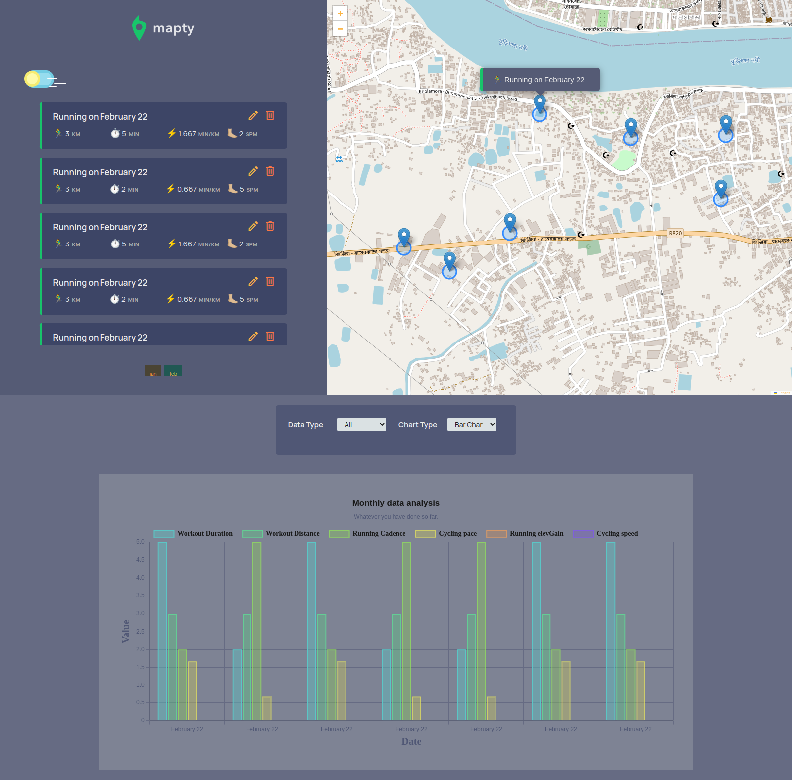

# Mapty 2.0

This project is inspired by a Udemy course instructed by `Jonas Schmedtmann`.

Udemy course link: [The Complete JavaScript Course 2023: From Zero to Expert!
](https://www.udemy.com/course/the-complete-javascript-course/)

## Technologeis

- Html
- Css
- Javascript

### Plugin

- Leaflet library (https://github.com/Leaflet/Leaflet)
- sweetalert2 (https://github.com/sweetalert2/sweetalert2)
- pro-paginate (https://github.com/robiulhr/pro-paginate)
- chart.js (https://github.com/chartjs/Chart.js/)

### Live site link

[click here](https://robiulhr.github.io/Mapty2.0/)
